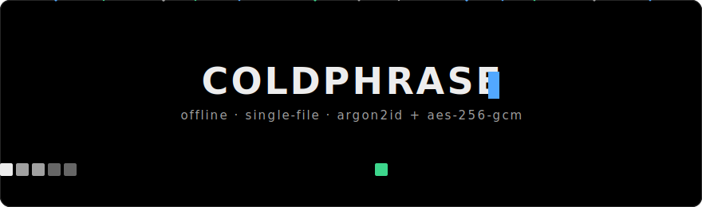
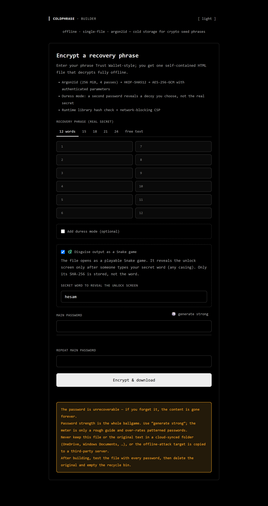
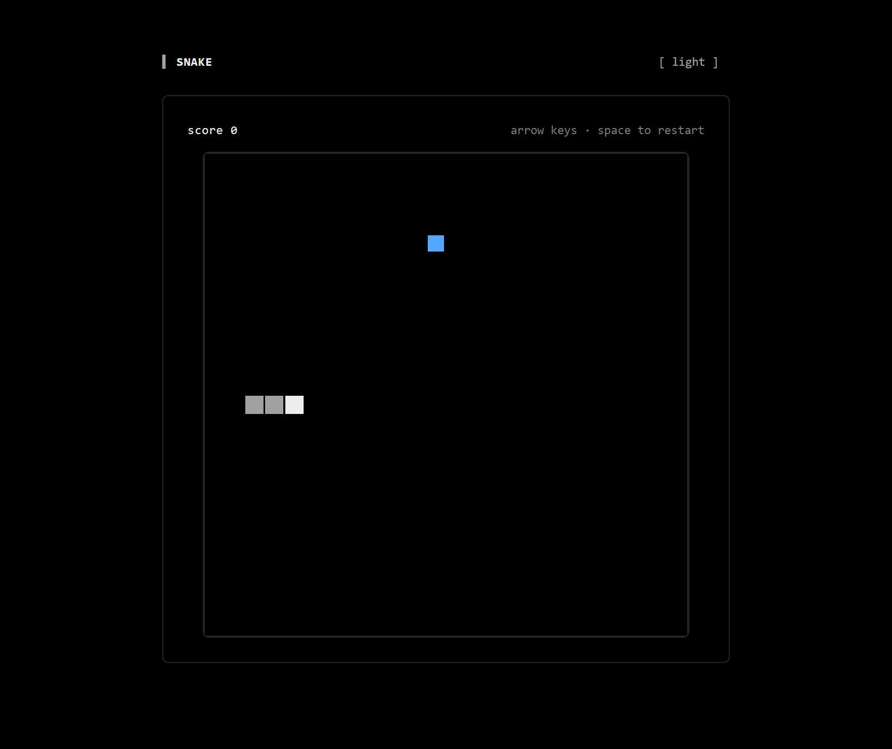
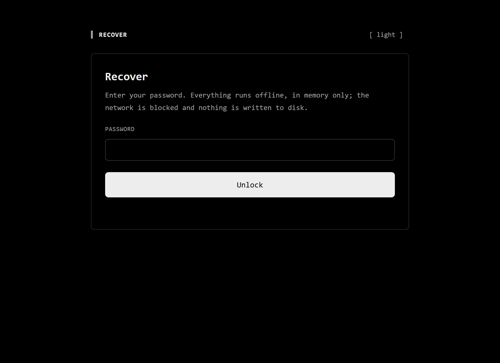
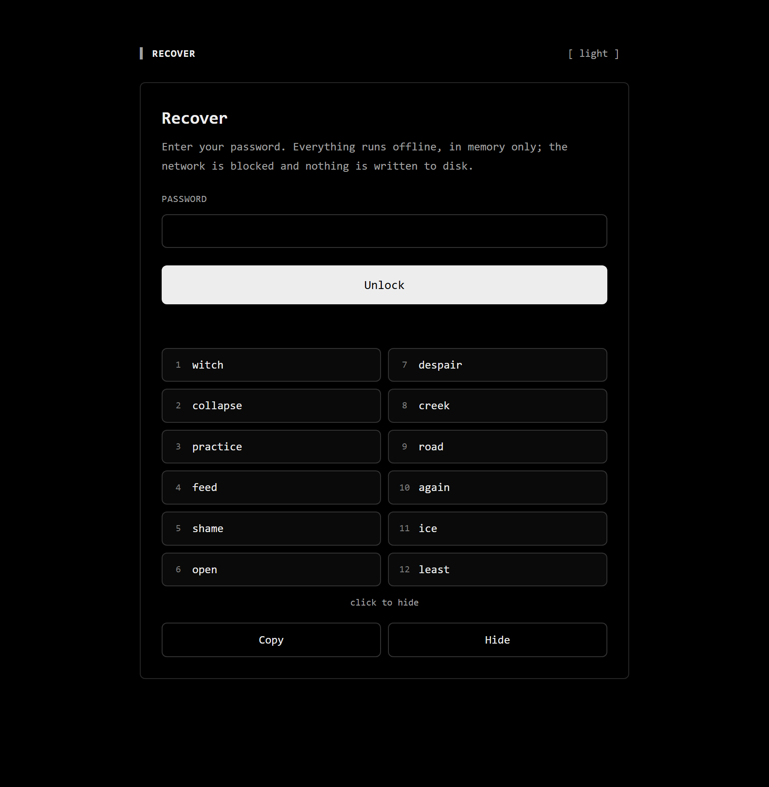

<div align="center">



# ColdPhrase

**Offline, single-file cold storage for crypto seed phrases.**
Argon2id + AES-256-GCM in one self-contained HTML file — with a duress decoy and an optional Snake-game disguise.

<p>
  
  
  
  
  
  <a href="https://github.com/morpheusadam/coldphrase/stargazers"></a>
</p>

</div>

> Encrypt a wallet recovery phrase into **one self-contained HTML file** that decrypts
> **fully offline** — no server, no install, no dependencies at runtime. Hardened with
> **Argon2id + AES-256-GCM**, a **duress decoy**, tamper detection, and a network-blocking CSP.

ColdPhrase turns a Trust Wallet / MetaMask–style **BIP39 seed phrase** (or any secret text)
into a portable `wallet-secret.html`. Double-click that file in any browser, type your
password, and the phrase appears — decrypted in memory only, on a machine that can be
completely offline. Nothing is uploaded, nothing is written to disk, and the file has
**zero runtime dependencies** (the Argon2 WebAssembly and wordlists are embedded and
integrity-checked).

This is **defensive**, self-custody tooling: it protects *your own* keys. It is open source
so the cryptography can be audited byte for byte.

---

## Why

A seed phrase written on paper burns, floods, and gets photographed. A seed phrase in a
plaintext file, a notes app, or a screenshot is one sync away from a breach. ColdPhrase gives
you a **third option**: an encrypted file you can copy to a USB stick, a second laptop, or an
optical disc, that needs no software to open and no network to work — while forcing any
attacker who steals it into a memory-hard offline brute-force against a strong password.

## Features

| | |
|---|---|
| **Single file, offline** | One `.html`. Opens by double-click in any modern browser, air-gapped. |
| **Argon2id KDF** | 256 MiB memory cost, 4 passes — memory-hard, GPU/ASIC-resistant. |
| **AES-256-GCM** | Authenticated encryption; all KDF parameters bound as AAD (tamper-evident). |
| **Duress decoy** | A second password reveals a decoy you choose — for coercion scenarios. |
| **Trust Wallet UX** | Numbered two-column word grid, smart paste, live BIP39 validation. |
| **True-random generator** | Built-in EFF diceware passphrase generator (~78 bits, unbiased). |
| **Snake-game disguise** | Optional cover: the file opens as a **playable Snake game** and reveals the unlock screen only when *your* secret word is typed. |
| **Tamper detection** | Runtime SHA-256 check of the embedded library + published whole-file hash. |
| **Network-blocked** | Strict Content-Security-Policy; the viewer reaches no network at all. |
| **Theme-aware** | Light/dark, driven entirely by a design-token file. |

## Security at a glance

| Property | Value |
|---|---|
| Key-derivation function | Argon2id, m = 256 MiB, t = 4, p = 1, 32-byte output |
| Key separation | HKDF-SHA-512 |
| Cipher | AES-256-GCM (96-bit IV, 128-bit tag) |
| Parameter authentication | version, m, t, p, volume index, salt → GCM AAD |
| Salt / IV | 256-bit salt and fresh 96-bit IV **per volume**, from `crypto.getRandomValues` |
| Password normalization | Unicode NFKC (prevents cross-keyboard lockout) |
| Generated passphrase entropy | ≈ 78 bits (6 × EFF-7776 diceware, rejection-sampled) |
| Volumes per file | always 2, randomized order, constant-time unlock |

See **[docs/CRYPTOGRAPHY.md](docs/CRYPTOGRAPHY.md)** for the full scheme and
**[docs/BENCHMARKS.md](docs/BENCHMARKS.md)** for cracking-cost math.

### How hard is it to break?

The cipher is never the target — only your password is. Behind Argon2id's memory-hard wall,
entropy is everything:

<div align="center"></div>

---

## Screenshots

<table>
  <tr>
    <td width="50%"><b>Builder — encrypt a phrase</b><br></td>
    <td width="50%"><b>Snake-game cover</b><br></td>
  </tr>
  <tr>
    <td width="50%"><b>Recover — unlock screen</b><br></td>
    <td width="50%"><b>Decrypted output</b><br></td>
  </tr>
</table>

The wallet file opens as the Snake game on the left; typing your secret word reveals the
unlock screen. All screens are theme-aware (dark shown).

---

## Quick start

### Use it (no build needed)

1. Download **[`dist/coldphrase.html`](dist/coldphrase.html)**.
2. **Verify** it against the published hash (recommended): compare its SHA-256 to
   [`dist/SHA256SUMS.txt`](dist/SHA256SUMS.txt).
   ```bash
   sha256sum coldphrase.html      # Linux/macOS
   certutil -hashfile coldphrase.html SHA256   # Windows
   ```
3. **Go offline** and open the file. Enter your phrase, click *generate strong* for a password, and *Encrypt & download*.
4. You get `wallet-secret.html` plus its own whole-file SHA-256. **Test it with every password**, record the hash off-machine, then delete the original phrase.

### Two ways to run the builder

| | Open | Best for |
|---|---|---|
| **Single-file** | `dist/coldphrase.html` | Portability — one file, copy it anywhere, works by double-click. |
| **Multi-file** | `web/index.html` | Readability — a thin page that imports `app.css`, `data/*.js`, and one small `js/*.js` per module. Easy to inspect and edit. |

Both are byte-for-byte the same behaviour and both run fully offline over `file://` (classic
`<script src>`, no bundler, no server). The **wallet file the builder produces is always a
single self-contained file** regardless of which builder you use.

### Build from source

```bash
npm run build     # -> dist/coldphrase.html (+SHA256SUMS) and web/ (multi-file)
npm test          # crypto + build-integrity + end-to-end tests
```

No dependencies to install — the build and tests use only Node's standard library and the
vendored assets.

## How it works (30 seconds)

```
password ──NFKC──▶ Argon2id(256MiB,t4) ──▶ HKDF-SHA512 ──▶ AES-256-GCM key
                                                                 │
recovery phrase ──[tag]──────────────────────────────────────▶ encrypt ──▶ volume
                          params+salt+index ─────▶ GCM AAD (authenticated)
```

A file carries **two volumes** in random order. Your main password opens the *primary*
volume; a duress password (if set) opens a *decoy*. Unlock derives keys for **all** volumes
so timing never reveals which password you used. Full details:
**[docs/CRYPTOGRAPHY.md](docs/CRYPTOGRAPHY.md)**, **[docs/DENIABILITY.md](docs/DENIABILITY.md)**.

### Cover mode (Snake-game disguise)

Enable *Disguise output as a Snake game* and the file downloads as `snake-game.html`. Opened,
it is a real, playable Snake game — no wallet UI in sight. It reveals the password screen only
when someone **types your chosen secret word** (any casing; caps-lock doesn't matter). Only the
word's **SHA-256** is stored in the file, not the word itself. This hides the file's *purpose*
from a casual observer; it is not steganography — see the honest scope in
**[docs/DENIABILITY.md](docs/DENIABILITY.md)**.

## What ColdPhrase does *not* protect against

Honesty matters more than marketing. ColdPhrase raises the cost of an *offline* attack to
"astronomical" **only if your password is strong**, and it cannot defend a compromised
machine. It does **not** protect against keyloggers, malicious browser extensions,
screen capture, or memory scraping; its deniability is *structural*, not cryptographic
(a sophisticated adversary reading the file sees two volumes); and a decoy is only
convincing if it is a *funded* wallet. Read **[docs/THREAT-MODEL.md](docs/THREAT-MODEL.md)**
before trusting it with anything valuable.

## Integrity & supply chain

The Argon2 library is verified against a pinned SHA-256 **at runtime** before it executes —
but a fully-replaced file could also rewrite that check, so the real anchor is the
**whole-file SHA-256** published in [`dist/SHA256SUMS.txt`](dist/SHA256SUMS.txt). Every
vendored asset is listed with its hash in [`LICENSE`](LICENSE) and
[docs/SECURITY-MODEL.md](docs/SECURITY-MODEL.md).

## Project structure

Modular source, compiled into one file by a small build. See
**[docs/AI-HELP.md](docs/AI-HELP.md)** for a machine-readable map and
**[docs/ARCHITECTURE.md](docs/ARCHITECTURE.md)** for the pipeline.

```
src/{js,styles,templates}   modular source (English, DOM-free crypto core)
vendor/{hash-wasm,wordlists} pinned third-party assets (+ hashes)
build/                       token→CSS generator + single-file bundler
tests/                       crypto, build-integrity, and end-to-end suites
design/design-tokens.json    the single source of visual truth
dist/                        built app + SHA256SUMS
docs/                        cryptography, threat model, benchmarks, FAQ, changelog
```

## Documentation

- [CRYPTOGRAPHY.md](docs/CRYPTOGRAPHY.md) — the full scheme, with rationale
- [SECURITY-MODEL.md](docs/SECURITY-MODEL.md) — defenses in depth, CSP, integrity
- [THREAT-MODEL.md](docs/THREAT-MODEL.md) — attackers, what's covered, what's not
- [DENIABILITY.md](docs/DENIABILITY.md) — the duress design, honestly scoped
- [BENCHMARKS.md](docs/BENCHMARKS.md) — Argon2 timings and brute-force cost math
- [ARCHITECTURE.md](docs/ARCHITECTURE.md) — repo layout and build pipeline
- [AI-HELP.md](docs/AI-HELP.md) — structure map for humans and AI agents
- [FAQ.md](docs/FAQ.md) · [CHANGELOG.md](docs/CHANGELOG.md)

## Keywords

seed phrase encryption · crypto wallet cold storage · offline seed backup ·
BIP39 mnemonic encryption · Argon2id · AES-256-GCM · WebCrypto · Trust Wallet backup ·
MetaMask recovery phrase · hardware-free cold wallet · plausible deniability · duress password ·
self-custody · air-gapped encryption · single-file HTML encryptor · zero-dependency.

## Star history

If ColdPhrase is useful to you, a ⭐ helps other self-custodians find it.

<a href="https://star-history.com/#morpheusadam/coldphrase&Date">
  
</a>

## License

MIT — see [LICENSE](LICENSE). Bundled third-party components retain their own licenses.
Use at your own risk; there is no warranty. **You are responsible for your keys.**
